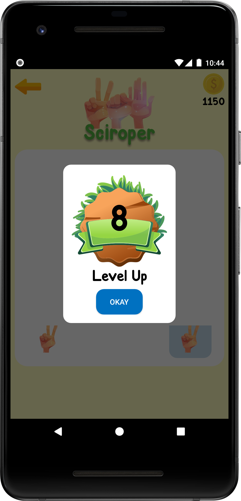
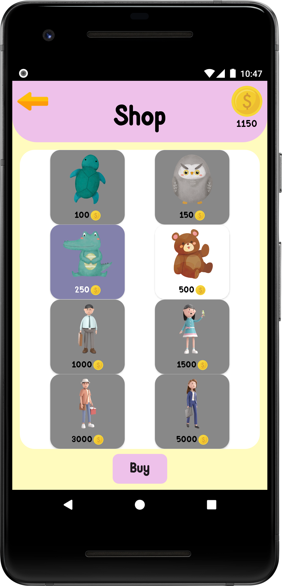

# Sciroper-MVVM
Rock Paper Scissors game Android using MVVM(Model View ViewModel)

This project was developed by several people, if you want to see who it is, [click here](https://github.com/riskiilyas/Sciroper-Android-Game/graphs/contributors)
## Feature:
- Splash Screen
- Landing Page
- SignIn/SignUP
- Menu
- Gameplay-pvp/pvc
- Shop
- How To Play
- LeaderBoard-Realtime
- History
- Background Music
- Push Notification
- DarkMode
- Profile
- Share

## Components:
- View Pager2
- Glide
- Dots Indicator
- Room-Coroutine
- Lottie
- Circle Image
- Data Binding
- RecyclerView
- SharedPreferences
- Firebase-RealDatabase
- Firebase-Push Notification
- Retrofit(Moshi)-Coroutine
- LiveData
- View Model
- Navigation
- Android Youtube Player
- Okhttp3

## Screenshot

  
  
  

if you want to see more screenshots [click here](https://github.com/rahmatsugiarto/Sciroper-MVVM/tree/master/ss)
